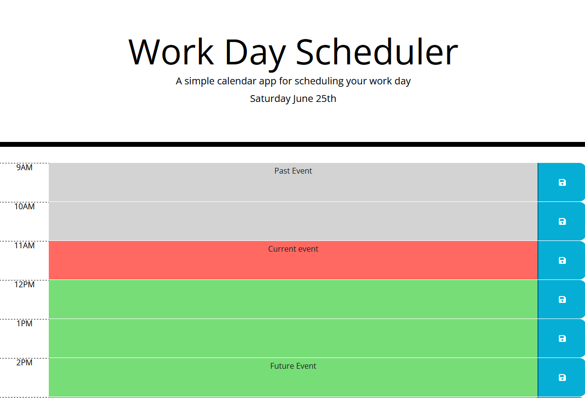

# Work Day Scheduler

## Description
The web page will allow the user to plan their work day (between 9am and 5pm) by the hour, highlighting the current hour in red, and greying out hours that have past.

 https://spyromancy.github.io/super-disco/